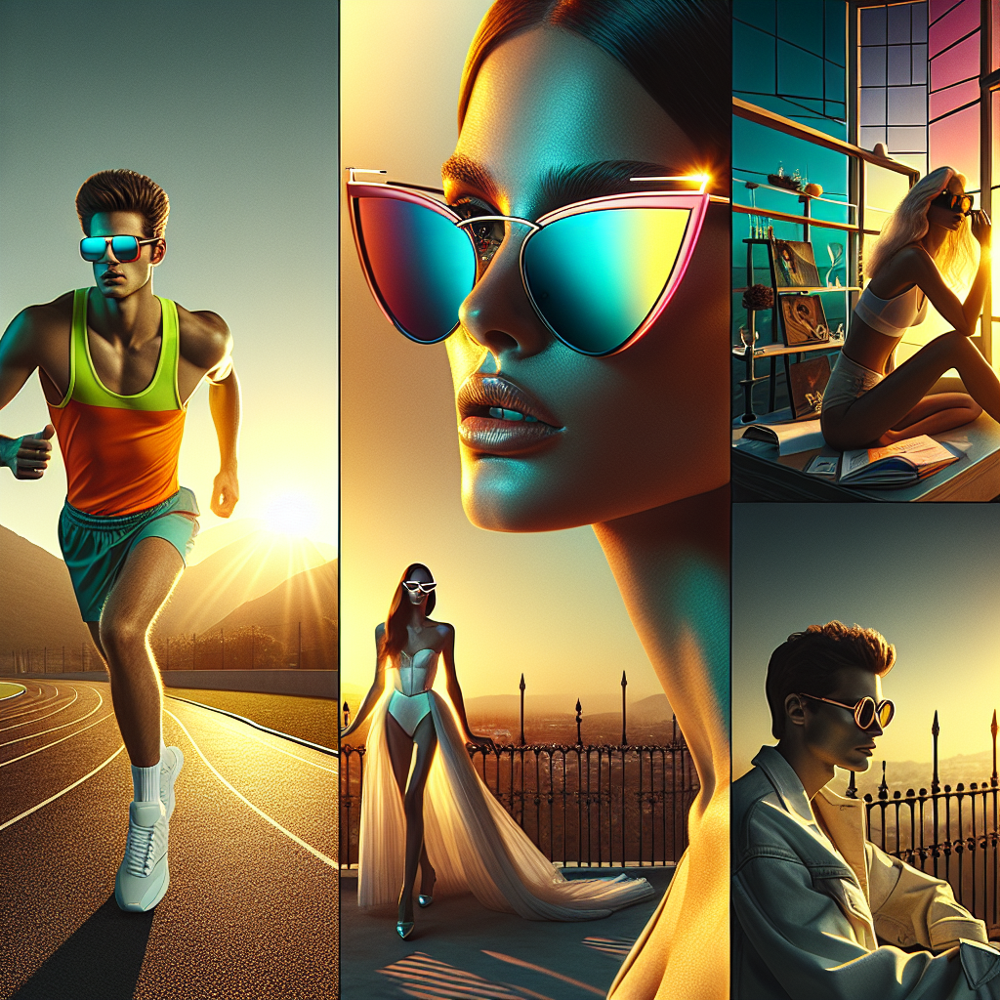

# 🕶️ Summer Sunglasses Campaign – Executive Summary

## 📊 Refined Trend Insights
Executive Summary  
For Summer 2025, we recommend spotlighting three distinct eyewear categories—Futuristic Wraparounds, Retro-Glam Cat-Eyes, and Reimagined Classics—to maximize market impact, maintain healthy margins, and deliver a visually unified campaign.

1. Key Trends  
 • Futuristic Wraparound “Sport Couture”  
   – Single-lens shields and streamlined silhouettes dominate runways and social feeds, appealing to the athleisure and performance-wear audience.  
 • Retro-Glam Cat-Eye  
   – A return to ’50s/’60s Hollywood elegance, characterized by upswept corners and decorative temples that speak to the fashion-forward consumer.  
 • Timeless Classics Reimagined  
   – Updated Aviators and Wayfarers blend heritage proportions with modern finishes, satisfying both minimalist and legacy-brand enthusiasts.

2. Featured Styles  
 • SG004 “Sport” Wraparound  
   – High-impact shield lens, ergonomic rubber grips, ultra-light frame. Ideal for the performance-meets-fashion segment.  
 • SG003 “Mystique” Cat-Eye  
   – Sculpted acetate, refined upswept temples, polished silhouette. Captures the essence of vintage glamour with a contemporary twist.  
 • SG001 “Aviator”  
   – Slim metal frame, classic teardrop lens. A perennial bestseller, now refreshed for today’s taste profile.

3. Strategic Rationale  
 • Comprehensive Market Coverage  
   – Targets three high-growth consumer segments—athleisure innovators, style-savvy trendsetters, and heritage purists—capturing broad appeal.  
 • Inventory & Margin Strength  
   – All three styles are well-stocked and competitively priced ($86–$144), allowing for promotional agility while preserving profitability.  
 • Cohesive Creative Direction  
   – Shared design cues (clean lines, high-contrast pairings) enable a “Day-to-Night” hero campaign that tells one unified brand story across digital, in-store, and social channels.

By centering our Summer 2025 initiative on these strategically chosen styles, we will harness emerging consumer trends, reinforce our position in key segments, and drive both traffic and conversion for a compelling seasonal rollout.

## 🎯 Campaign Visual

    

## ✍️ Campaign Quote
From Sprint to Sunset: Sport Couture Meets Retro Glam and Classic Cool

## ✅ Why This Works
This phrase reflects the image’s trio of looks — a shield-style runner at sunrise, a retro-glam cat-eye in golden light, and a sleek aviator at sunset — while calling out the key Summer ’25 trends: futuristic sport-chic, vintage Hollywood flair, and reimagined classics in one cohesive Day-to-Night campaign.

---

*Report generated on 2025-12-29*
